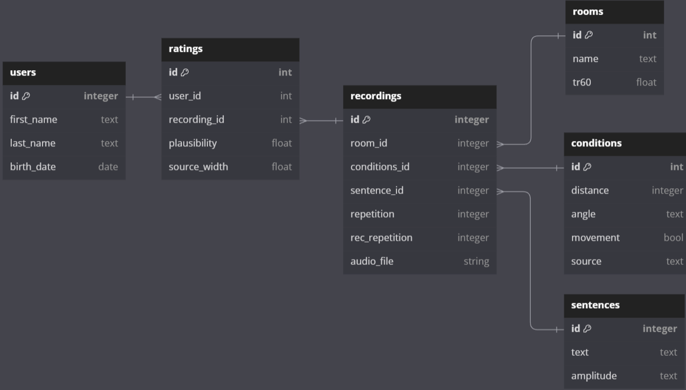
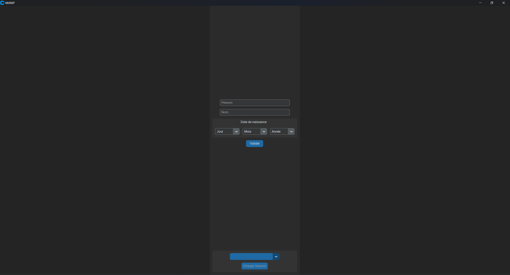
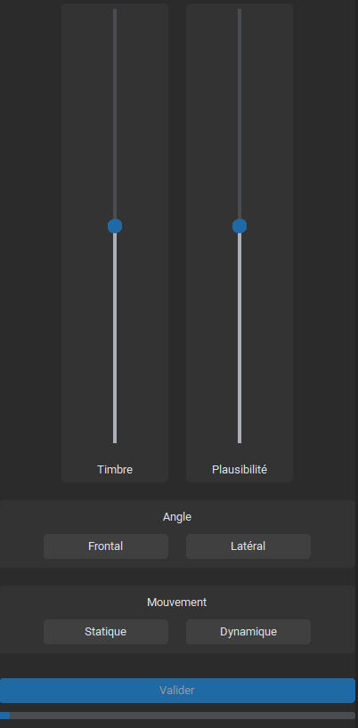

# Application for rating binaural sounds

## Aim of the application

This MVC software was developped for a psychoacoustics experiment. During the experiment, binaural recordings will be presented to listeners, whose task is to rate each recording on the basis of 3 attributes: the **Timbre**, the **Apparent Source Width** and the **Plausibility**.

## Description of the recordings

The rated sounds are recordings of a male voice uttering sentences while performing (or not) head movements. This voice could be either live-spoken or played through a loudspeaker (which reproduced the head movements of the human speaker). These sentences were recorded according to different states of the following variables:

|Source|Distance|Facing Angle|Movement Amplitude|Movement|
|:---:|:---:|:---:|:---:|:---:|
|Human|1 m|Front|Small|True|
|Loudspeaker|4 m|Side|Large|False|

3 different sentences were recorded thanks to a dummy head (Neumann KU100) for each combination of these variables (ex: a loudspeaker placed 1 meter away from the dummy head, facing the dummy head, displaying a sentence that implies large head movements but while performing no movement).

All these sentences are stored in the `data/sentences.csv` file. This file is used by the program to initialize the SQLite database. The sentences list was created using the code provided in the [utils_manip_directivite repo](https://github.com/Gautzilla/utils_manip_directivite).

## Database

The database contains a table storing all **recordings**, gathered from the `data/sentences.csv` file. Each **user** will complete one set of **rating** (containing a value for each of the 3 rated attributes) for each **recording**:

The database is initialized (i.e. the **recordings**, **conditions**, **rooms** and **sentences** tables are filled with the test data) if the `initialize_db` parameter of the `initialize_app` function of the app controller is set to true (see `app.py`). Setting `initialize_db` to **True** will have no effect if a database with tables matching the data already exists.

The database connection is set in the `model/__init__.py` file of the model package.

# Structure of the application

## Dependencies

All required packages are listed in the `requirements.txt` file.

## Login 

When launching the app, the app controller (`controller/app_controller.py`) instantiates a **LoginController** (`controller/login_controller.py`), which will manage the user sign in or log in thanks to the login view (`view/login_view.py`) and model (`model/login_model.py`).

The customtkinter view allows for creating a new user (an error message is displayed if both the first and last name isn't provided, or if a valid birthdate hasn't been given) or for logging in (the droplist at the bottom of the interface only shows the users that didn't rate all recordings yet).

## Rating

Once a user is logged in, the **LoginController** gives back the control to the **AppController**, which instantiates a new **RatingsController** (`controller/ratings_controller.py`). 

the **RatingsController**, along with a ratings view (`view/ratings_view.py`) and model (`model/ratings_model.py`) will record the user's rating for each recording:

Before each rating, the ratings model queries the database for a random recording that has not yet been rated by the logged user. If there is no such recording, the test ends. Otherwise, the ratings view is reset and the audio file matching the selected recording is played (through the **audio player model** `model/audio_player_model.py` that uses the `pygame` package). 

The user is free to adjust the sliders matching their rating for each attribute for the current recording. Once the playback is done, the user is free to validate the ratings and advance to the next recording.